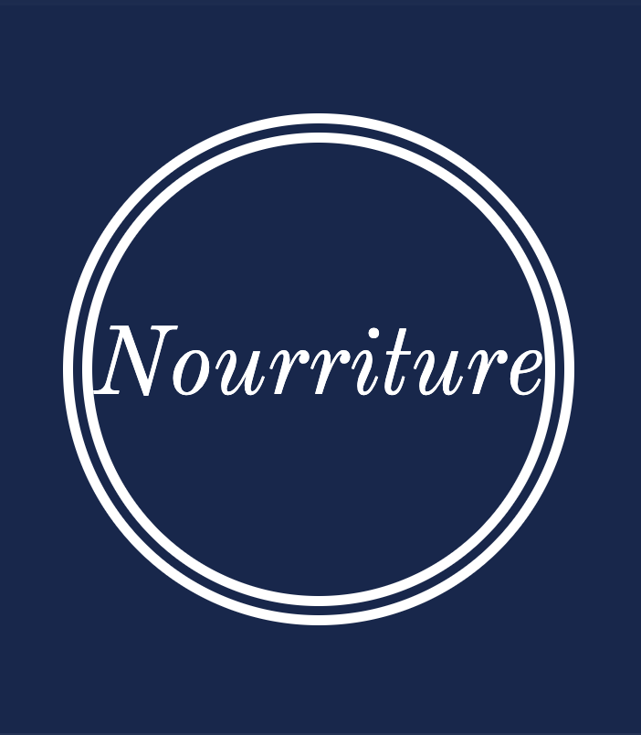
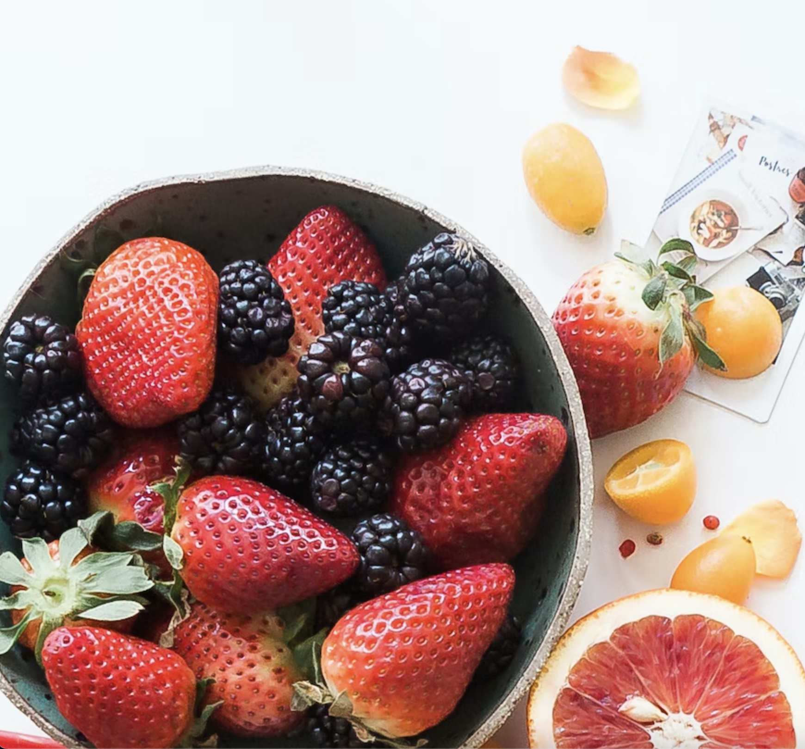
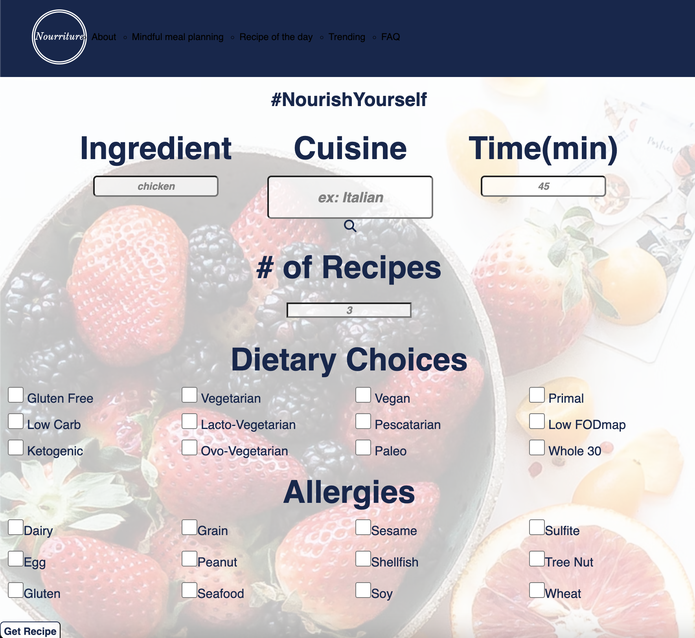
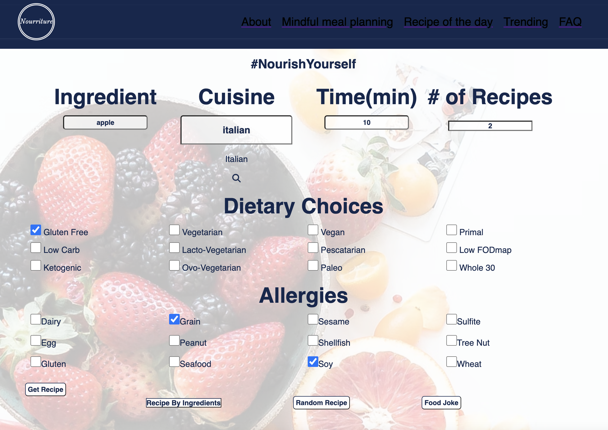
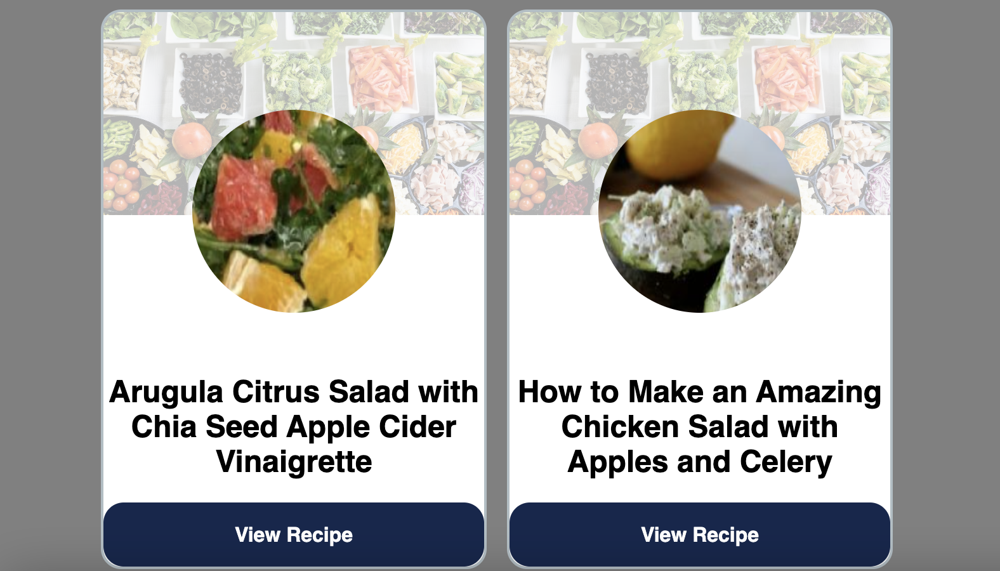
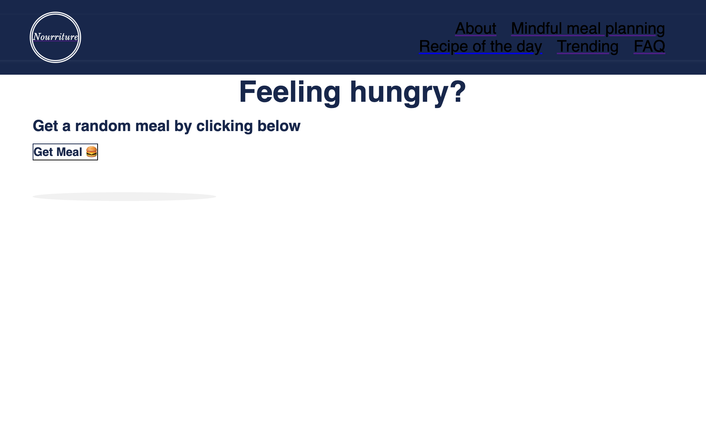
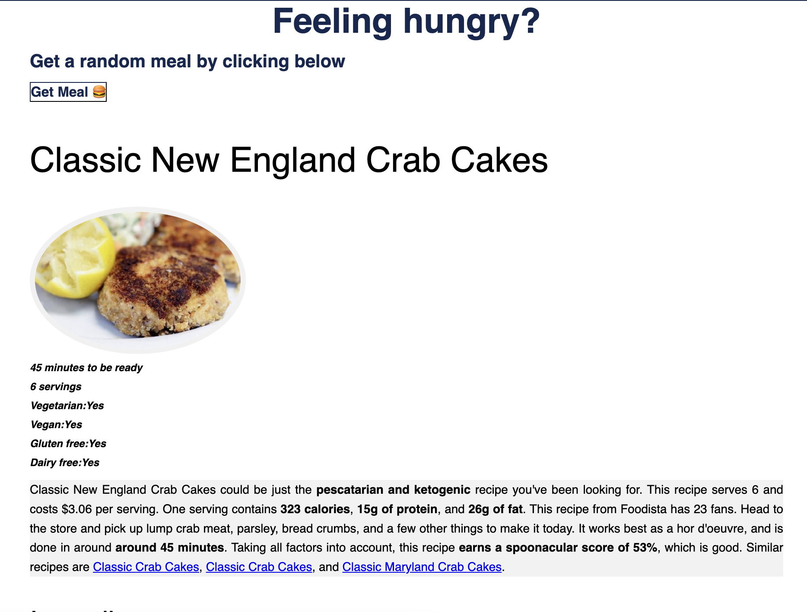
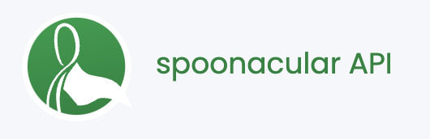
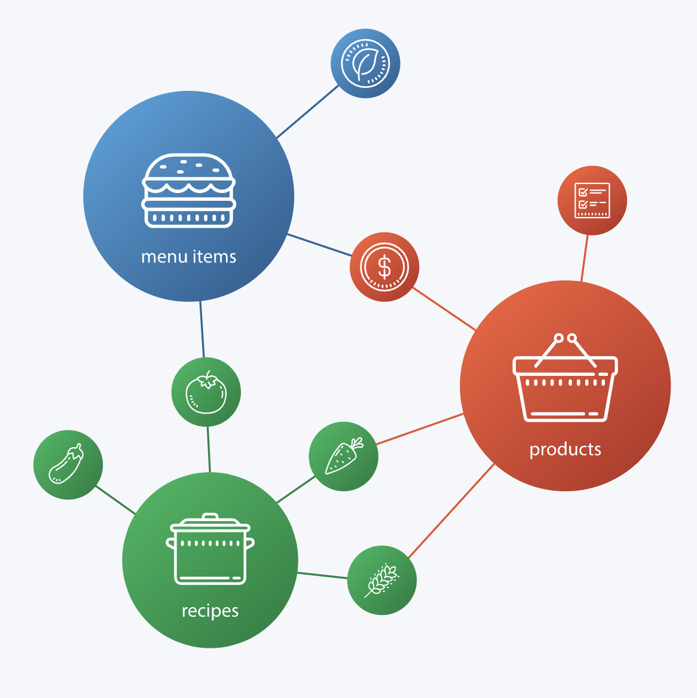

# Nourriture
## Food Recipe Website

Find your next meal here!

## Welcome Screen

Nourriture welcomes you with a splash screen that you are able to enter your name for a personalized feel for your search. One you enter the site you are greeted by a search bar with different parameters.

## Functionality

You are able to search the database of spoonacular with the parameters you desire to fit your dietary needs. You can search by ingredients, the type of cuisine you want to eat, the time you have to prepare the meal, and how many recipes you want to be shown.

Dietary choices and allergies can be selected to further refine the choices you want shown. The results are shows on the bottom of the page.

No choice, leave it up to chance. Try out a random recipe.

Hit the button and your results are shown.

You are given ingredients, quantities, and a step by step guide on how to make the recipe.

## Spoonacular API

Built using the spoonacular api. Spoonacular hosts data based on ingredients, recipes, products and menu items. 

[Spoonacular API](https://spoonacular.com/food-api)

# Built by Anna, Hodan, Oscar, Ron

Digital Crafts Cohort built this page as our first assignment. 

[Anna Github](https://github.com/Anna-Dosev)

Anna worked on the Introduction Splash page and cuisine live search functionality.

[Hodan Github](https://github.com/hodansuleiman)

Hodan worked on the mobile navbar and random recipe page.

[Oscar Github](https://github.com/Ozzythegrouch)

Oscar worked on the API calls for the site and jokes section. 
Wrote the README file for github. Made site ready for deployment. 

Oscar used javascript, HTML, and css to complete the responsibilities he had. 
The API call was one of the trickiest portions of this project. Making sure the string interpolation worked within the call was arduous. 

[Ron Github](https://github.com/rcleveland30)

Ron worked on the title landing page and contributors page.

# Technologies Used

<h3><a target="_blank" href="https://icons8.com/icon/Q5FXgRZybr2A/html-5-is-a-software-solution-stack-that-defines-the-properties-and-behaviors-of-web-page">HTML 5 </a> icon by <a target="_blank" href="https://icons8.com">Icons8</a></h3>

<h3><a target="_blank" href="https://icons8.com/icon/21278/css3">CSS</a> icon by <a target="_blank" href="https://icons8.com">Icons8</a></h3>

<h3><a target="_blank" href="https://icons8.com/icon/PXTY4q2Sq2lG/javascript">JavaScript</a> icon by <a target="_blank" href="https://icons8.com">Icons8</a></h3>

<h3><a target="_blank" href="https://icons8.com/icon/84710/bootstrap">Bootstrap</a> icon by <a target="_blank" href="https://icons8.com">Icons8</a></h3>

	